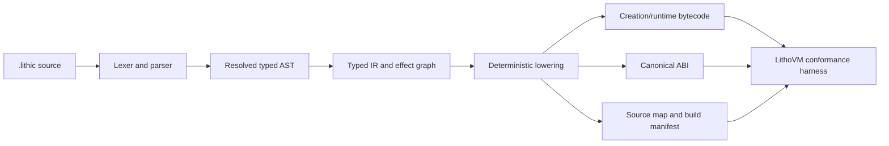

# RFC 0002: Lithic compiler v1 semantics and conformance freeze

| | |
|-|-|
| **Status**       | Draft — blocking decisions and owners are unassigned |
| **Author(s)**    | J. King Kasr (`@jkasr`) / Litho Agent (`@lithoagent`) |
| **Sponsor**      | KaJ Labs / Litho Foundation |
| **Created**      | 2026-09-21 |
| **Last Updated** | 2026-09-21 |
| **Discussion**   | [PR #202](https://github.com/KaJLabs/Lithosphere/pull/202) |
| **Supersedes**   | (none) |

## Summary

The current `lithc` is an honest declaration-level front end and does not emit
deployable bytecode. This RFC is the decision intake required to freeze a
minimum Lithic v1 language, ABI, LithoVM target, diagnostic contract, and
conformance suite before implementation begins. It deliberately makes no
language or virtual-machine decisions: every unresolved choice remains marked
`Pending` until the named owners provide a written decision. Merging this draft
publishes the intake only; it does not approve semantics, code generation,
deployment, or a public toolchain release.

## Motivation

The existing front end parses declarations and stores function bodies as raw
source. A prior semantic draft inferred primitive types, overload behavior,
map-key restrictions, and return rules without an approved specification; those
assumptions were removed before merge. Implementing code generation now would
repeat that failure mode and could produce bytecode whose behavior, storage
layout, ABI, or gas use differs from the chain team's intended contract.

This blocks contract developers, tooling authors, security reviewers, release
engineering, and `lithdev`. The cost of inaction is that the eight named tools
remain preview/specification boundaries; the cost of guessing is materially
higher because incompatible compiler output can strand contracts or assets.

## Goals & Non-Goals

**Goals**

- Record an owner-approved, normative Lithic v1 grammar and semantic contract.
- Freeze the exact LithoVM/EVM target, ABI, storage, bytecode, source-map, and
  diagnostic interfaces required by compiler implementation.
- Define executable positive, negative, and cross-platform conformance vectors
  before code generation is accepted.
- Establish explicit security and release gates from experimental code through
  signed public artifacts.

**Non-Goals**

- Implementing type checking, lowering, code generation, deployment, or any
  other tool in this RFC.
- Selecting answers on behalf of the Lithic, LithoVM/Chain, Product, Security,
  or Release owners.
- Activating the separate authorization/effect-model candidate or treating it
  as consensus-approved input.
- Promoting `lithls`, `lithtest`, `lithsec`, or `lithpkg` beyond their current
  specification-only boundaries.
- Authorizing mainnet compilation, deployment, or a public release.

## Decision authority and acceptance rule

This RFC remains **Draft** until every blocking row below has a written
decision, normative testable text, and the required owner approval. A pull
request approval or merge of this draft is not acceptance of any pending row.

| Authority | Required approval scope | Assigned owner | State |
|---|---|---|---|
| Lithic language owner | Grammar, name resolution, type system, and source semantics | KaJ Labs / Litho Foundation rotation (`@jkasr`, `@lithoagent`) | Assigned; decisions pending |
| LithoVM/Chain owner | VM revision, execution, storage, gas, ABI, precompiles, and failure semantics | KaJ Labs / Litho Foundation rotation (`@jkasr`, `@lithoagent`) | Assigned; decisions pending |
| Product owner | Supported v1 surface and compatibility promise | KaJ Labs / Litho Foundation rotation (`@jkasr`, `@lithoagent`) | Assigned; decisions pending |
| Security reviewer | Threat model, resource bounds, unsafe capabilities, and negative corpus | KaJ Labs / Litho Foundation rotation (`@jkasr`, `@lithoagent`) | Assigned; decisions pending |
| Release owner | Platforms, provenance, signing, installation, rollback, and support policy | KaJ Labs / Litho Foundation rotation (`@jkasr`, `@lithoagent`) | Assigned; decisions pending |

## Detailed Design

### Architecture

The accepted contract must define every solid boundary below. The current
implementation stops after declaration parsing and conservative name checks;
function bodies remain raw source.

### Normative decision register

`Pending` means no behavior may be inferred or implemented as accepted.

| ID | Blocking decision | Required normative output | Owner | Decision |
|---|---|---|---|---|
| L-01 | Full statement and expression grammar | Versioned grammar covering control flow, assignment, calls, literals, attributes, error recovery, and any asynchronous construct | Lithic | Pending |
| L-02 | Names and resolution | Scopes, shadowing, visibility, imports, overload resolution, selector collisions, and ambiguity errors | Lithic | Pending |
| L-03 | Type system | Primitive widths/signedness, address/bytes/string rules, maps, conversions, inference, equality, returns, and definite assignment | Lithic + Security | Pending |
| L-04 | Arithmetic and evaluation | Overflow/underflow, division, shifts, evaluation order, short-circuiting, and constant evaluation | Lithic + LithoVM | Pending |
| E-01 | Execution model | Internal/external calls, native value, reentrancy boundary, recursion, dynamic calls, events, revert/panic/error behavior, and determinism | LithoVM + Security | Pending |
| E-02 | State model | Storage layout/version, initialization, map encoding, deletion/default values, upgrade compatibility, and collision rules | LithoVM + Security | Pending |
| V-01 | Target VM | Exact LithoVM/EVM revision, instruction set, enabled precompiles, chain-specific behavior, code-size/resource limits, and target identifier | LithoVM/Chain | Pending |
| V-02 | Gas and resources | Authoritative gas schedule, compile-time limits, runtime limits, out-of-gas behavior, and versioning | LithoVM/Chain | Pending |
| A-01 | ABI | Canonical JSON schema/order, types, selector and event hashing, errors, constructor, receive/fallback behavior, and version field | Lithic + LithoVM | Pending |
| B-01 | Bytecode artifact | Creation/runtime layout, metadata policy, linking, reproducibility rules, and canonical hashes | LithoVM + Release | Pending |
| D-01 | Diagnostics | Stable code namespace, severity policy, source spans, path normalization, human and machine-readable schemas, and compatibility | Lithic + Product | Pending |
| D-02 | Source maps | Span unit, generated instruction mapping, inlining/macro policy if applicable, and debugger-facing schema | Lithic + LithoVM | Pending |
| C-01 | Conformance | Reference VM/version and versioned positive, negative, execution, gas, ABI, bytecode-hash, and reproducibility vectors | All technical owners | Pending |
| R-01 | Release boundary | Versioning, supported platforms, compatibility, signed provenance, install/upgrade, rollback, and independent acceptance | Product + Release + Security | Pending |

### Required conformance-vector schema

The final C-01 decision must define a machine-readable schema that, at minimum,
binds each vector to:

- source bytes and compiler/target identifiers;
- expected diagnostics or exact creation/runtime bytecode hashes;
- canonical ABI and source-map hashes;
- initial chain state, call input, caller, value, block/environment inputs, and
  enabled precompiles;
- expected return/revert data, logs, calls, storage/state delta, and gas result;
- expected result on every supported host platform.

Vectors must include accepted programs and rejected programs at each grammar,
typing, capability, resource, and VM boundary. The corpus location, license,
change-control owner, and immutable version identifier are all pending C-01.

### Data Model / Schema Changes

No runtime schema change is proposed by this draft. Acceptance must define and
version the compiler's typed AST/IR contract, ABI JSON, source map, build
manifest, diagnostic JSON, and conformance-vector schema before their first
stable release. Backwards compatibility is pending R-01; no current preview
artifact promises compatibility.

### API / Interface Changes

No CLI behavior changes are authorized here. Before implementation, the
accepted revision must specify:

- `lithc` inputs, emit modes, target selection, exit codes, and output paths;
- deterministic handling of filesystem paths and environment-dependent data;
- schema/version identifiers in every machine-readable artifact;
- whether experimental code generation is exposed and the explicit opt-in flag;
- which ABI and bytecode outputs `lithdev` may consume.

### Operational Considerations

- Code generation must initially be default-off and excluded from public
  release artifacts.
- Builds must be reproducible on every supported platform with artifact hashes
  checked by CI.
- Compiler resource ceilings and timeout behavior must be measurable and
  fail-closed on untrusted source.
- Conformance runs must record compiler commit, target revision, corpus version,
  host platform, artifact hashes, and reference-VM identity.
- No secret, signer, RPC write capability, or production account is needed to
  decide or test compiler semantics.

### Security & Privacy

Compiler source and dependencies are an untrusted-input and supply-chain attack
surface. The accepted specification must bound parsing/type-checking resource
use; reject unsupported syntax, types, effects, and target features; avoid host
path/time/environment influence on artifacts; and define safe handling of debug
paths. Undefined behavior is not an acceptable outcome: unsupported or
ambiguous programs fail closed with stable diagnostics.

The separate Authorization Policy and Lithic Effect Model V1 document is a
disabled, non-consensus remediation candidate. It may become an input only
after its own chain/security approval; this RFC neither imports nor activates
it by reference.

## Alternatives Considered

- **Implement conventional Solidity/EVM semantics by assumption.** Rejected
  because familiar behavior is not evidence of Lithic or LithoVM approval.
- **Transpile Lithic to Solidity and delegate semantics to another compiler.**
  Not selected because it still requires an approved semantic mapping, compiler
  trust/version policy, source maps, and conformance evidence.
- **Keep the declaration-only preview indefinitely.** Safe in the short term,
  but it does not meet the requested deployable compiler/toolchain outcome.

## Drawbacks

Freezing decisions before implementation delays visible code generation and
requires several owners to coordinate. The register is deliberately detailed,
which may expose more design work than initially expected. Conversely, changing
an accepted decision later will require versioning and potentially a new target
or language revision rather than a silent compiler change.

## Rollout Plan

1. Assign the five authorities and resolve every decision-register row in a
   reviewed revision of this RFC.
2. Land the machine-readable conformance schema and owner-approved vectors
   before the corresponding compiler implementation.
3. Implement parsing, typing, IR, and code generation behind an explicit
   experimental, default-off, non-release boundary.
4. Pass negative diagnostics, deterministic cross-platform builds, and
   reference-VM conformance on CI.
5. Exercise generated contracts on an approved devnet with no production keys
   or funds, then obtain independent compiler/security acceptance.
6. Only after separate Product and Release approval, publish signed,
   checksummed, provenance-bearing release artifacts and clean-host smoke tests.

There is no mainnet rollout in this RFC. Any deployment support or mainnet use
requires a separate approval and rollback plan after the compiler is accepted.

## Unresolved Questions

- [x] Who is the accountable Lithic language owner? KaJ Labs / Litho Foundation rotation: `@jkasr`, `@lithoagent`.
- [x] Who is the accountable LithoVM/Chain semantics owner? KaJ Labs / Litho Foundation rotation: `@jkasr`, `@lithoagent`.
- [x] Who owns Product, Security, and Release acceptance? KaJ Labs / Litho Foundation rotation: `@jkasr`, `@lithoagent`.
- [ ] What are the approved answers and normative text for L-01 through R-01?
- [ ] What repository and change-control process own the conformance corpus?
- [ ] What exact compiler and target versioning rule handles future breaking
      semantic or VM changes?
- [ ] What minimum soak, external review, and clean-host evidence are required
      before a public v1 release?

## Success Metrics

- Every decision-register row is resolved with named owner approval and no
  remaining `Pending` value before the RFC becomes Accepted.
- The accepted conformance corpus covers every normative grammar, type,
  execution, ABI, diagnostic, resource, and failure boundary.
- Identical source and target inputs produce byte-identical outputs on all
  supported platforms.
- Generated contracts match the approved reference VM for state, calls, logs,
  return/revert data, and gas across the complete corpus.
- No compiler/tool is promoted or released before its documented acceptance
  gates and independent security/release approvals pass.

## References

- [`toolchain/README.md`](../../../toolchain/README.md)
- [`toolchain/PREVIEW.md`](../../../toolchain/PREVIEW.md)
- [`docs/makalu-extra-works-handoff.md`](../../makalu-extra-works-handoff.md)
- [`AUTHORIZATION_AND_LITHIC_EFFECT_MODEL_V1.md`](../../workstreams/lithic-pq-security/remediation/AUTHORIZATION_AND_LITHIC_EFFECT_MODEL_V1.md)
- [`toolchain/specs/lithls.md`](../../../toolchain/specs/lithls.md)
- [`toolchain/specs/lithtest.md`](../../../toolchain/specs/lithtest.md)
- [`toolchain/specs/lithsec.md`](../../../toolchain/specs/lithsec.md)
- [`toolchain/specs/lithpkg.md`](../../../toolchain/specs/lithpkg.md)
